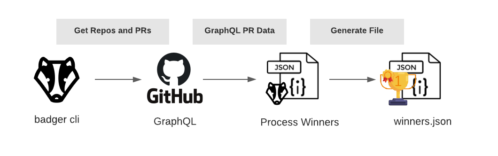
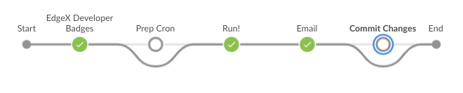

# edgex-dev-badge

[](https://github.com/edgexfoundry/edgex-dev-badge/pulls) [](https://github.com/edgexfoundry/edgex-dev-badge/contributors) [](https://github.com/orgs/edgexfoundry/teams/devops-core-team/members) [](https://github.com/edgexfoundry/edgex-dev-badge/commits) [](https://pybuilder.io/)
[](https://radon.readthedocs.io/en/latest/api.html#module-radon.complexity)
[](https://pypi.org/project/bandit/)
[](https://www.python.org/downloads/)

* [edgex-dev-badge](#edgex-dev-badge)
  * [Current Badges](#current-badges)
  * [Summary](#summary)
    * [Badger CLI](#badger-cli)
    * [Badger Pipeline](#badger-pipeline)
    * [Parameters](#parameters)
  * [Local Usage](#local-usage)
    * [badger](#badger)
  * [Reference](#reference)
  * [Examples](#examples)
  * [Docker](#docker)

## Current Badges

- Bug Hunter: Submit two PR's and have them merged into the upstream codebase.

## Summary

### Badger CLI



The badger cli is a set of python scripts that are main workhorse that queries GitHub and determines the winners of the badges based on the badges defined in the [badges.yml](./badges.yml) file at root of the project. The `badges.yml` file contains all the metadata that defines the badges and is required for badger to work. Badger will scan a GitHub organization and return ALL non-archived repositories for that organization as well as exclude any repositories listed in the `global>exclude` portion of the `badges.yml` file. After it finds all qualifying repositories it will query the last N days (default 30) of Pull Requests (PR) and determine what PR author's qualify for the badge based on the `trigger` section of the `badges.yml` file. Once winners are determined, they will be written to a json file (default winners.json).

> Note: GitHub users must have a public email address exposed in order to qualify. See more [here](https://docs.github.com/en/account-and-profile/setting-up-and-managing-your-github-user-account/managing-email-preferences).

For more information on cli usage see: [Local Usage](#local-usage)

### Badger Pipeline



### Parameters

* **LOOKBACK_WINDOW** (number) How many days from current date to search for PRs for a specific repo
* **NO_LOOKBACK** (boolean) Do not use lookback window and search ALL PRs
* **DRY_RUN** (boolean) Should we run the job in no op mode

Jenkins automation combines the badger cli and email Jenkins' email capabilities to send badge winners an email. Jenkins will build a badger docker images according to the [Dockerfile.build](./Dockerfile.build) and will create an on demand agent. The badger cli is then called to generate the winners.json file. If there are any winners, a unique HTML email is generated for each winner. When `DRY_RUN` is `true`, the emails are saved to Jenkins as an artifact. When `DRY_RUN` is `false`, the email or emails are sent to the winners. An "admin" email is also generated containing all the winners in case someone wants to follow up with them.

## Local Usage

🚨 Local script usage requires a GitHub [Personal Access Token](https://github.com/settings/tokens) (PAT) exported to the environment as `GH_TOKEN_PSW`. The PAT must have the scopes: `public_repo, read:user, user:email`

### `badger`

```text
                    ___,,___
           _,-='=- =-  -`"--.__,,.._
        ,-;// /  - -       -   -= - "=.
      ,'///    -     -   -   =  - ==-=\`.
     |/// /  =    `. - =   == - =.=_,,._ `=/|
    ///    -   -    \  - - = ,ndDMHHMM  \
  ,' - / /        / /\ =  - /MM(,,._`YQMML  `|
 <_,=^Kkm / / / / ///H|wnWWdMKKK#""-;. `"0\  |
        `""QkmernesTOMM|""WHMKKMM\   `--. \> \
 hjm          `""'  `->>>    ``WHMb,.    `-_<@)
                                `"QMM`.
                                   `>>>
                  I badge so you don't have to.
    
usage: badger [-h] [--org ORG] [--badges BADGES] [--winners WINNERS] [--lookback LOOKBACK] [--no-lookback] [--execute]

Rules based GitHub badge scanner

optional arguments:
  -h, --help           show this help message and exit
  --org ORG            The organization to lookup (default: edgexfoundry)
  --badges BADGES      badge file to lookup rules (default: ./badges.yml)
  --winners WINNERS    File to write winners json to (default: ./winners.json)
  --lookback LOOKBACK  Lookback window for PRs (default: 30)
  --no-lookback        Do not use lookback window and search all PRs (default: False)
  --execute            execute processing - not setting is same as running in NOOP mode (default: False)
```

## Reference

[](https://asciinema.org/a/SYIE11BkySPMJ2HBCkcecb2zU)

## Examples

Simple example just to query the `edgexfoundry` org for PR's closed within the last 30 days

```bash
$ badger --org edgexfoundry && cat ./winners.json
...
Getting repositories for org "edgexfoundry"
Done processing 021 PRs for edgex-go
Done processing 004 PRs for edgex-ui-go
...
{"count": 1, "badge_details": {"bug_hunter": {"display": "Bug Hunter",...
```

🚨 By default the cli is designed to be idempotent so it runs in no op mode. This means the winners will NOT be recorded every time the script runs. To record the winners and exclude them from future runs of the badger cli, you will need to pass the `--execute` flag. This will automatically save the winners GitHub username in the `badges/<badge_id>` file.

```bash
$ badger --org edgexfoundry --execute && cat ./winners.json
...
Getting repositories for org "edgexfoundry"
Done processing 021 PRs for edgex-go
Done processing 004 PRs for edgex-ui-go
...
{"count": 1, "badge_details": {"bug_hunter": {"display": "Bug Hunter",...

$ cat badges/bug_hunter
user1
user2
user3
```

Simple example just to query the `edgexfoundry` org for PR's closed within the last 365 days

```bash
$ badger --org edgexfoundry --lookback 365 && cat ./winners.json
...
{"count": 1, "badge_details": {"bug_hunter": {"display": "Bug Hunter",...
```

More complex example to query the `edgexfoundry` org for ALL PR's ever closed and use a different badge yaml file and write the winners to a different directory.

```bash
$ badger --org edgexfoundry --no-lookback --badges super-badges.yml --winners super-winners.json && cat ./super-winners.json
...
{"count": 1, "badge_details": {"bug_hunter": {"display": "Bug Hunter",...
```

## Docker

A docker image can be used in lieu of working with native Python. This is what the Jenkins build uses.

```bash
docker build -t badger:latest -f Dockerfile.build .

docker run --rm \
  -v $PWD:/code -w /code \
  -e GH_TOKEN_PSW=<token> \
  --entrypoint="" \
  badger:latest \
  badger --org edgexfoundry ...
```

---

> Badger Icon provided by: <https://icons8.com>